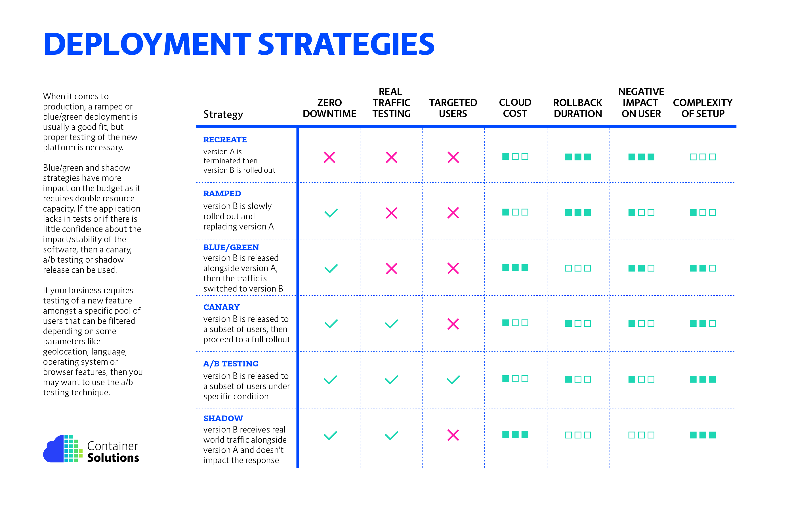

# Cluster Architecture, Installation & Configuration

## Understand Kubernetes components and architecture

Basic Micro serice architecure:

1. Codebase: Maintain one codebase per application, tracked in version control. This helps manage changes, rollbacks, and collaboration effectively.

2. Dependencies: Explicitly declare and isolate dependencies. Use package managers to define dependencies and avoid relying on system-wide dependencies.

3. Config: Store configuration in the environment. Keep configurations (like credentials, API keys, etc.) separate from code, allowing easy configuration changes without code modifications.

4. Backing services: Treat backing services (databases, caches, etc.) as attached resources. Access them via environment variables or service discovery mechanisms.

5. Build, release, run: Strictly separate build, release, and run stages. Maintain a clear distinction between building the app, releasing it to a specific environment, and running it in that environment.

6. Processes: Execute the app as one or more stateless processes. Applications should be designed to be stateless, share-nothing processes that can start and stop gracefully.

7. Port binding: Export services via port binding. Services should be self-contained and expose themselves via a port, allowing them to be easily connected to the outside world.

8. Concurrency: Scale out via the process model. Scale by running multiple processes and scaling horizontally rather than vertically by increasing the resources of a single instance.

9. Disposability: Maximize robustness with fast startup and graceful shutdown. Apps should be able to start up quickly and shut down gracefully, handling sudden failures or updates seamlessly.

10. Dev/prod parity: Keep development, staging, and production environments as similar as possible. Reducing discrepancies between environments minimizes bugs and deployment issues.

11. Logs: Treat logs as event streams. Applications should generate logs as event streams and leave log management and analysis to external tools.

12. Admin processes: Run admin/management tasks as one-off processes. Provide a way to run administrative or maintenance tasks separately from the main application.

k8s designed to support all the above factors. Kubernetes have different components to cater for each requirement as below.

1.  Kubernetes Control Plane:

        API Server: Accepts and processes requests from users and other components.

        Controller Manager: Monitors the state of the cluster and takes corrective

    actions.

            * kube-Scheduler: Assigns pods to worker nodes. which? pods goes where?

            * etcd: Stores the cluster state as key-value pairs

2.  Kubernetes Worker Nodes:
    Run containerised applications (pods).
    Managed by the control plane.
    Communicate with the control plane via the kubelet agent.

3.  Kubelet Controller :
    agent responsible for manage nods in the kubernetes cluster.

4.  Pods:
    The basic unit of deployment in Kubernetes.
    Group one or more containers and shared storage.
    Scheduled to run on worker nodes.

5.  Deployments:
    Manage the creation and scaling of pods.
    Define a desired state for a set of pods.
    Kubernetes automatically creates or deletes pods to match the desired state.

6.  Services:
    Provide a stable endpoint for pods.
    Load balance traffic across pods in a set.
    Can be exposed internally or externally to the cluster.

7.  Namespaces:
    Logical partitions of a Kubernetes cluster.
    Isolate resources and prevent conflicts between applications.
    create a namespace
    <code>kubectl create namespace dev </code>

    ```yaml
    apiversion: v1
    kind: namespace
    metadata:
      name: dev
    ```

change default namespace

<code>kubectl config set-context $(kubectl config current-context) --namespace=dev </code>

- Resource Quota : Limit resource for a given namespace

  ```yaml
  apiversion: v1
  kind: ResourceQuota
  metadata:
    name: compute-quota
    namespace: dev
  spec:
    hard:
      pods: "10"
      requests.cpu: "4" # guranteed cpu units
      requests.memory: "5Gi" # guranteed memory utilization
      limits.cpu: "10" # maximum cpu utilization
      limits.memory: "10Gi" #maximum memory utilization
  ```

7. Networking:

   Pods can communicate with each other using IP addresses or DNS names in pod network created using kube-proxy service.
   Services provide a single point of access for pods.
   Ingress controllers allow external traffic to reach pods.

8. Storage:

   Persistent storage can be attached to pods using PersistentVolumes and PersistentVolumeClaims.
   Different storage classes can be used to provision different types of storage.

9. Security:

   Kubernetes provides role-based access control (RBAC) to control access to the cluster.
   Pods can be run with security contexts to limit their privileges.
   Network policies can be used to control traffic between pods.

10. Lables

    simply key value pairs
    use to metion or describe resource (pods, nodes) own sparticular group

11. Selectors

    filter pods using lables apply function (network policy, deployments).

12. workloads

    type of workload :

    - replica-sets : maintain the set of pods as metions in pod yaml

    - deployment : create pods
      deployment --> replicaSet --> Pods

    - daemonSet : create pods in each node in the cluster (onitoring agent,log tools)

    - StatefulSet :
      Maintain state of pods even in recreated. Usefull when creating clustered applications (Database, Redis, etc).

      - pods need persitant state (ex: map storage to pod)
      - start pods in ordered list

    - Jobs : Pod need run and stop do specific task

    - cronjobs : same as job but execute as defined schedule

13. Services

    access the pods using unifed method. create single interface to all the pods which serve single task.

```yaml
apiVersion: v1
kind: Service
metadata:
  name: my-service
spec:
  type: NodePort
  selector:
    app: nginx
  ports:
    - port: 80
      targetPort: 80
      # Optional field
      # By default and for convenience, the Kubernetes control plane will allocate a port from a range (default: 30000-32767)
      nodePort: 30007
```

how to call service

`<service name>.<namespace>.svc.cluster.local`

type of services to communicate

1. CLsuterIP :
   commubicate with in the cluster using pod networking

```yaml
apiVersion: apps/v1
kind: Deployment
metadata:
  name: review-deployment
  labels:
    app: review
spec:
  replicas: 3
  selector:
    matchLabels:
      app: review
  template:
    metadata:
      labels:
        app: review
    spec:
      containers:
        - name: review-app
          image: chamilaliyanage/echo-env-http:1.1
          ports:
            - containerPort: 8080
          env:
            - name: MY_POD_IP
              valueFrom:
                fieldRef:
                  fieldPath: status.podIP
            - name: MY_APP_NAME
              value: review-application
---
kind: Service
apiVersion: v1
metadata:
  name: review-service
spec:
  selector:
    app: review
  ports:
    - port: 80
      targetPort: 8080
```

2. NodePort :
   extend cluster service to external network (node network)

```yaml
apiVersion: v1
kind: Service
metadata:
  name: my-nodeport-service
spec:
  type: NodePort
  selector:
    app: my-app
  ports:
    - protocol: TCP
      port: 80
      targetPort: 8080 # app's container port
      nodePort: 30000 # pecify a specific nodePort or Kubernetes will assign one
```

3. LoadBalancer : distributes incoming traffic among your app's pods and is cloud-provider-specific.

```yaml
apiVersion: v1
kind: Service
metadata:
  name: my-loadbalancer-service
spec:
  type: LoadBalancer
  selector:
    app: my-app
  ports:
    - protocol: TCP
      port: 80
      targetPort: 8080 #  app's container port
```

4. ExternalName:

```yaml
apiversion: v1
kind: service
metadata:
  name: example-externalName
spec:
  type: ExternalName
  externalName: rds.aws.com
```

5. Ingress : <br>
   API object manage external acess to the internal services by defining and enforcing routing rules for incoming HTTP and HTTPS traffic,
   Popular tools like nginx, HAProxy. Ingress controller can

- Route traffic to internal service by path base or name base routing
- ssl terminate
- ```yaml
  apiVersion: networking.k8s.io/v1
  kind: Ingress
  metadata:
    name: example-ingress
    annotations:
    nginx.ingress.kubernetes.io/rewrite-target: /
  spec:
    rules:
      - host: example.com
        http:
          paths:
            - path: /app
              pathType: Prefix
              backend:
                service:
                  name: example-service
                  port:
                    number: 80
  ```

## Manage role-based access control (RBAC)

- shoud know how to create, modify and delete RBACs.

## Use Kubeadm to install a basic cluster

- should be able to operate the kubeadm tool to set up a Kubernetes cluster

## Manage a highly-available Kubernetes cluster

- should be able to understand how to add nodes to the cluster and configure it to be highly available

## Provision underlying infrastructure to deploy a Kubernetes cluster

- main goal here is to be able to lay the groundwork for a Kubernetes cluster installation (network, storage, dependencies, etc.)

Installing Kubeadm
Create a cluster Kubeadm
For kubernetes to work, you need to have

Certain system configurations
Container runtime (CRI-O, Containerd, or Docker)
kubeadm
kubelet and kubectl

## Perform a version upgrade on a Kubernetes cluster using Kubeadm

- will be asked to upgrade a Kubernetes cluster using Kubeadm.

upgrade Kubeadm Cluster

## Implement etcd backup and restore

should learn and practice using the etcdctl utility to backup and restore etcd.

Etcd is the cluster’s key-value store. All cluster configurations and information about pods, services, and so on are stored in key-value format here.

etcd Backup & Restore Operations

# Workloads & Scheduling

type of workload :

- replica-sets: maintain the set of pods as metions in pod yaml

  ```yaml
  apiVersion: apps/v1
  kind: ReplicaSet
  metadata:
    name: sample-Replset
    labels:
      name:
      type:
  spec:
    template:
      metadata:
        name: sample-webapp
        label:
          name: frontend
          type: webapp
      spec:
        container:
          - name: web-server
            image: nginx
    replicas: 3
    selector:
  ```

  - Deployment: create pods
    deployment --> replicaSet --> Pods

  - daemonSet: create pods in each node in the cluster (monitoring agent, log tools)

  - StatefulSet :
    Maintain the state of pods even in recreation. Useful when creating clustered applications (Database, Redis, etc).

    - pods need persitant state (ex: map storage to pod)
    - start pods in ordered list

  - Jobs : Pod need run and stop do specific task

  - cronjobs : same as job but execute as defined schedule

## Understand deployments and how to perform rolling update and rollbacks

Kubernetes Deployment ensures that an application has a minimum number of replicas running at all times. In the event that a replica fails, the Kubernetes API ensures that a new one is created within minutes.

In the Exam , you should know how to do rollbacks and rollouts of deployments.

Kubernetes Deployment Concepts

1. Recreate [native]
2. Ramped [native] [default]
   - ramp update or rolling update
3. Blue/Green

   - red/black deployment, create new version traffic route instantly.this can be done by changing serive selector label patching once version 2 created. easy to rollback and rollforward. high resource utilization

4. Canary

   - same as ramped update change route to percentage of traffic.can do this by create pods count as per percentage each versions. then use same service for both version. this can be done with service mesh like [Istio]

5. A/B Testing

   - route traffic to reach version based on incoming traffic metadata like device type, geo-location, user type,

6. Shadow
   - The mirror version does actively respond in the mirror state. use test application load testing, application behaviour error without impact to users.



Kubernetes Rolling Update

for the deployment, we use yaml configuration file to define the deployment. In deployment, yaml has important properties

```yaml
apiversion: v1,v1beta, apps/v1 etc
kind: pod, services, deployment etc
metadata: <meta data of pod>
  name:
  labels:
spec: <specification of pod>
```

## Use ConfigMaps and Secrets to configure applications

Configmaps in Kubernetes are useful for storing non-critical data in key-value pair format. They can also be used to inject environment variables into pods.

In the Exam, you should know how to use configmaps and secrets objects to create, modify, and delete variables and secrets and make them available to a pod.

Kubernetes Configmap Concepts
Kubernetes Secrets Concepts

## Know how to scale applications

Kubernetes offers a variety of ways to scale applications, including the use of deployment objects to increase the number of replicas of your application.

Horizontal Pod Autoscalers (HPAs) can be used to increase the number of replicas based on application metrics.

For the Exam , you should be able to scale a pod/deployment. You can follow this tutorial.

Working With Horizontal Pod Autoscaler

### autoscaling

auto scale pod or cluster size based on metrics. simply use basic metrics like CPU, and memory but can use external metrics like message queue size, and object type kind of metrics using external adapters.

1. HPA
2. Cluster autoscale

```yaml
apiVersion: autoscaling/v2
kind: HorizontalPodAutoscaler
metadata:
  name: cpu_mem_hpa
  label:
    site: zone
    env: prod
spec:
  maxReplicas: 10
  minReplicas: 1
  scaleTargetRef:
    apiVersion: apps/v1
    kind: Deployment
    name: node-app
  metrics:
    -type: Resource
      resource:
        name: memory
        target:
          type: Utilization
          everrageUtilizationL: 75
    type: Resource
      resource:
        name: cpu
        target:
          type: Utilization
          everrageUtilizationL: 75
```

This HPA auto-scale pod count is based on. But only nodes have limitations of maximum pod count. then we need clsuter autoscalaer.

```yaml
apiVersion: autoscaling.openshift.io/v1
kind: ClusterAutoscaler
metadata:
  name: zone-prod-autoscaler
spec:
  scaleUp:
    policies:
      - name: zone-prod-cluster-scale-up-policy
        nodeSelector:
          matchLabels:
            node-role.kubernetes.io/worker: " " #this label used to apply only for worker nodes in cluster
        limits:
          cpu: "2000m"
          memory: "4Gi"
        delta: 3
        enabled: true
  scaleDown:
    policies:
      - name: cluster-scale-down-policy
        nodeSelector:
          matchLabels:
            node-role.kubernetes.io/worker: "" # this label used to apply only for worker nodes in cluster
        limits:
          cpu: "1000m"
          memory: "2Gi"
        delta: 3
        enabled: true
```

## Understand the primitives used to create robust, self-healing, application deployments

For any self-healing application, you should use deployments or stateful sets so that when pods fail, Kubernetes instantly recreates them.

Deployments also allow you to keep track of all the changes you make. You can also easily return to a previous state.

Kubernetes Deployments

## Understand how resource limits can affect Pod scheduling

Cluster management also includes workload management; as an administrator, you should ensure that each pod has access to resources based on its requirements.

Each pod in Kubernetes can be assigned a minimum and maximum CPU and memory usage.

- Manage Container Resources
- Pods with resource requests

You can use any of the following methods to choose where Kubernetes schedules specific Pods:

- <code>nodeSelector</code> field matching against node labels
- Affinity and anti-affinity
- nodeName field
- Pod topology spread constraints (taints and tollerents)

### node selector

simplest recommended form of node selection
lable k8s node with ssd label

```bash
kubectl label nodes <your-node-name> disktype=ssd
```

deploy pod to clsuter with selector

```yaml
apiVersion: v1
kind: Pod
metadata:
  name: nginx
  labels:
    env: test
spec:
  containers:
    - name: nginx
      image: nginx
  nodeSelector:
    disktype: ssd
```

### afinity and anti-afinity

affinity feature consists of two types

1. node afinity : like the <code>nodeSelector</code> field but is more expressive and allows you to specify soft rules.can use In, NotIn, Exists, DoesNotExist, Gt and Lt operators. NotIn and DoesNotExist quit similar to function of taints and tollerants,you can use it.

   - <code>requiredDuringSchedulingIgnoredDuringExecution</code>: The scheduler can't schedule the Pod unless the rule is met. This functions like nodeSelector, but with a more expressive syntax.
   - <code>preferredDuringSchedulingIgnoredDuringExecution</code>: The scheduler tries to find a node that meets the rule. If a matching node is not available, the scheduler still schedules the Pod.

example:

```yaml
apiVersion: v1
kind: Pod
metadata:
  name: with-node-affinity
spec:
  affinity:
    nodeAffinity:
      requiredDuringSchedulingIgnoredDuringExecution:
        nodeSelectorTerms:
          - matchExpressions:
              - key: topology.kubernetes.io/zone
                operator: In
                values:
                  - antarctica-east1
                  - antarctica-west1
      preferredDuringSchedulingIgnoredDuringExecution:
        - weight: 1
          preference:
            matchExpressions:
              - key: another-node-label-key
                operator: In
                values:
                  - another-node-label-value
  containers:
    - name: with-node-affinity
      image: registry.k8s.io/pause:2.0
```

2. Inter-pod affinity/anti-affinity allows you to constrain Pods against labels on other Pods

## Awareness of manifest management and common templating tools

This section assumes you’re familiar with tools like kustomiz, helm, etc.

In general, during the Exam, you should be able to create, modify and apply Kubernetes manifests

Managing Kubernetes Objects
Manage objects with Kustomize

# Services & Networking

## Understand host networking configuration on the cluster nodes

Kube-proxy is a component that must be installed on each worker node in order for pods to communicate with one another. Kube proxy participation is required for node networking.

Kubelet is the process by which a worker node communicates with the master node. All of these concepts are required to comprehend networking within Kubernetes.

Kubernetes Networking

## Understand connectivity between Pods

Pods communicate with one another via services. This is made possible by the Kube proxy component.

Understand Kube Proxy

## Understand ClusterIP, NodePort, and LoadBalancer service types and endpoints

Understanding each service type and their use cases is critical. Understanding how pods can be added to a service should be given special consideration.

Kubernetes Service
External Resource Exposure

type of services

1. CLsuterIP :
   commubicate with in the cluster using pod networking

```yaml
apiVersion: apps/v1
kind: Deployment
metadata:
  name: review-deployment
  labels:
    app: review
spec:
  replicas: 3
  selector:
    matchLabels:
      app: review
  template:
    metadata:
      labels:
        app: review
    spec:
      containers:
        - name: review-app
          image: chamilaliyanage/echo-env-http:1.1
          ports:
            - containerPort: 8080
          env:
            - name: MY_POD_IP
              valueFrom:
                fieldRef:
                  fieldPath: status.podIP
            - name: MY_APP_NAME
              value: review-application
---
kind: Service
apiVersion: v1
metadata:
  name: review-service
spec:
  selector:
    app: review
  ports:
    - port: 80
      targetPort: 8080
```

2. NodePort :
   extend cluster service to external network (node network)

```yaml
apiVersion: v1
kind: Service
metadata:
  name: my-nodeport-service
spec:
  type: NodePort
  selector:
    app: my-app
  ports:
    - protocol: TCP
      port: 80
      targetPort: 8080 # app's container port
      nodePort: 30000 # pecify a specific nodePort or Kubernetes will assign one
```

3. LoadBalancer : distributes incoming traffic among your app's pods and is cloud-provider-specific.

```yaml
apiVersion: v1
kind: Service
metadata:
  name: my-loadbalancer-service
spec:
  type: LoadBalancer
  selector:
    app: my-app
  ports:
    - protocol: TCP
      port: 80
      targetPort: 8080 #  app's container port
```

4. ExternalName:

```yaml
apiversion: v1
kind: service
metadata:
  name: example-externalName
spec:
  type: ExternalName
  externalName: rds.aws.com
```

5. Ingress : <br>
   API object manage external acess to the internal services by defining and enforcing routing rules for incoming HTTP and HTTPS traffic,
   Popular tools like nginx, HAProxy. Ingress controller can

- Route traffic to internal service by path base or name base routing
- ssl terminate
- ```yaml
  apiVersion: networking.k8s.io/v1
  kind: Ingress
  metadata:
    name: example-ingress
    annotations:
    nginx.ingress.kubernetes.io/rewrite-target: /
  spec:
    rules:
      - host: example.com
        http:
          paths:
            - path: /app
              pathType: Prefix
              backend:
                service:
                  name: example-service
                  port:
                    number: 80
  ```


## Know how to use Ingress controllers and Ingress resources

External entities are granted access to internal cluster services via ingress resources. Ingress controllers are load balancers that enable it.

For the Exam, you should know how to create and configure Ingress Understand Ingress Controllers

Kubernetes Ingress
Kubernetes Ingress Controller
Ingress TLS/SSL Setup

## Know how to configure and use CoreDNS

CoreDNS is a highly adaptable and extensible DNS server that can act as the Kubernetes cluster DNS. The CNCF hosts the CoreDNS project, as it does Kubernetes.

Using CoreDNS for Service Discovery

## Choose an appropriate container network interface plugin

The Container Networking Interface (CNI) aims to develop a generic plugin-based networking solution for containers.

For the Exam, you should know how to choose a CNI according to your needs.

There are numerous options, including Flannel, Calico, and others.

Kubernetes Network Plugins
The network section accounts for 20% of the exam’s content. You’ll almost certainly be asked to create at least one network policy, endpoint, or ingress.

# Storage

## Understand storage classes, persistent volumes

Kubernetes Persistent Volumes

## Understand volume mode, access modes and reclaim policies for volumes

Kubernetes Volume Modes
Kubernetes Volume Access Modes

## Understand persistent volume claims primitive

Persistent Volumes Claims

## Know how to configure applications with persistent storage

By mounting a PVC, application pods can use persistent storage.

Configure Kubernetes Volume in Pod

# Troubleshooting

## Accessing the Cluster

Understanding different methods to access a Kubernetes cluster (kubectl, Kubernetes Dashboard, etc.).
Setting up kubeconfig files for authentication.
Using service accounts for authentication.

## Cluster Information

Retrieving cluster information using commands like kubectl cluster-info.

Checking the status of various cluster components (kubelet, kube-proxy, etcd, etc.).
Understanding cluster configuration files and their locations.

## Node Evaluation

Inspecting nodes in the cluster using kubectl get nodes or other relevant commands.

Gathering node-specific information such as capacity, allocatable resources, labels, and annotations.

Understanding node conditions and how to interpret them (Ready, OutOfDisk, MemoryPressure, etc.).

Identifying and troubleshooting node-related issues.

Investigating node problems using logs (kubelet, container runtime logs, etc.).

Dealing with node failures or unavailability.

## Evaluate cluster and node logging

Application logs can aid in understanding the application’s activities and status. The logs are especially useful for troubleshooting and monitoring cluster activity.

Examining logs of Kubernetes control plane components such as etcd and the scheduler can also be very beneficial.

### Kubernetes Logging

by default k8s support gets logs from stdout and stderr in container runtime. kublet writes those logs in a persistent location(/var/log) in each node. agents in each node(can collect logs and send log store/processor to keep logs.

example :
agent deploy in each node using daemonset deployment

```yaml
apiVersion: v1
kind: ConfigMap
metadata:
  name: filebeat-config
  namespace: zone-prod
data:
  filebeat.yml: |-
    filebeat.inputs:
    - type: container
      paths:
        - /var/log/pods/*/*.log
      processors:
        - add_kubernetes_metadata:
            in_cluster: true

    output.elasticsearch:
      hosts: ["elasticsearch.zone-prod.svc.cluster.local:9200"]
      username: "username"
      password: "password"

---
apiVersion: apps/v1
kind: DaemonSet
metadata:
  name: filebeat
  namespace: zone-prod
spec:
  selector:
    matchLabels:
      app: filebeat
  template:
    metadata:
      labels:
        app: filebeat
    spec:
      containers:
        - name: filebeat
          image: docker.elastic.co/beats/filebeat:latest
          args: ["-c", "/etc/filebeat.yml", "-e"]
          volumeMounts:
            - name: filebeat-config
              mountPath: /etc/filebeat.yml
              subPath: filebeat.yml
            - name: varlogpods
              mountPath: /var/log/pods
              readOnly: true
      volumes:
        - name: filebeat-config
          configMap:
            name: filebeat-config
        - name: varlogpods
          hostPath:
            path: /var/log/pods
```

deploy elastic search to store/process

create elastic search service

```yaml
apiVersion: v1
kind: service
metadata:
  name: elasticsearch
  namespace: zone-prod
  labels:
    env: prod
    site: zone
spec:
  selector:
    app: elasticseach
  clusterIP: None
  ports:
    - port: 9200
      name: rest
    - port: 9300
      name: inter-node

---
apiVersion: apps/v1
kind: StatefulSet
metadata:
  name: elasticsearch
spec:
  serviceName: elasticsearch
  replicas: 3
  selector:
    matchLabels:
      app: elasticsearch
  template:
    metadata:
      labels:
        app: elasticsearch
    spec:
      containers:
        - name: elasticsearch-prod
          image: docker.elastic.co/elasticsearch/elasticsearch:7.15.2
          ports:
            - containerPort: 9200
              name: rest
            - containerPort: 9300
              name: inter-node
          resources:
            limits:
              memory: 2Gi # Adjust resource limits as needed
            requests:
              memory: 1Gi # Adjust resource requests as needed
          env:
            - name: discovery.type
              value: single-node # For a single-node setup, can be changed for multi-node
```

## Understand how to monitor applications

Monitoring applications can be accomplished by storing logs and analyzing application metrics.

Tools like Prometheus and Grafana are popular because they make metric management simple.

### Cluster Health Monitoring

- Monitoring cluster health using built-in tools (metrics-server, Prometheus, etc.).
- Understanding the significance of different metrics (CPU, memory, network, etc.) in cluster evaluation.
- Interpreting monitoring data to identify and resolve issues.

### Monitoring & Logging & Debugging

Prometheus :
pull base target monitoring. use pushgateway to monitor short-lived targets like jobs

## Manage container stdout & stderr logs

Create a Logging agent (stdout & stderr )
Configuring and accessing cluster-level audit logs.
Understanding logging mechanisms in Kubernetes.
Using logs for troubleshooting and security analysis.

## Troubleshoot application failure

Administrators should also assist users in debugging applications that have been deployed into Kubernetes but are not behaving correctly.

Understanding Kubernetes Logging
Debug Kubernetes Objects

## Troubleshoot cluster component failure

When users are confident that their application is properly configured, cluster components must be debugged and troubleshooted for failures.
identifying and diagnosing issues affecting multiple nodes or the entire cluster.
Applying debugging techniques to resolve cluster-wide problems.
Recovering from cluster-level failures.
Debug Kubernetes Cluster

## Troubleshoot networking

There may be instances where things go wrong on the network end, such as incorrect configuration of ingress resources.

Cluster Networking

references: <https://teckbootcamps.com/cka-exam-study-guide/>


# Other Info

## Imparative vs Declarative Methods

 * imparative approach : how to implement
  commands: 
    - create objects <br>
<code> kubectl run --image=nginx nginx</code><br>
<code> kubectl create deployment --image=nginx nginx</code><br>
<code>kubectl expose deployment nginx --port 80  </code><br>
<code>kubectl create service clusterip redis --tcp=6379:6379</code><br>
<code>kubectl create service nodeport nginx --tcp=80:80 --node-port=30080</code><br>

    - update objects <br>
    <code>kubectl edit deployment nginx</code><br>
    <code>kubectl scale deployment nginx --replicas=5</code><br>
    <code>kubectl set image deployment nginx nginx=nginx:1.18</code><br>

 * Declarative approach : what to implement
  <code> kubectl apply -f resource-prod.yaml</code><br>